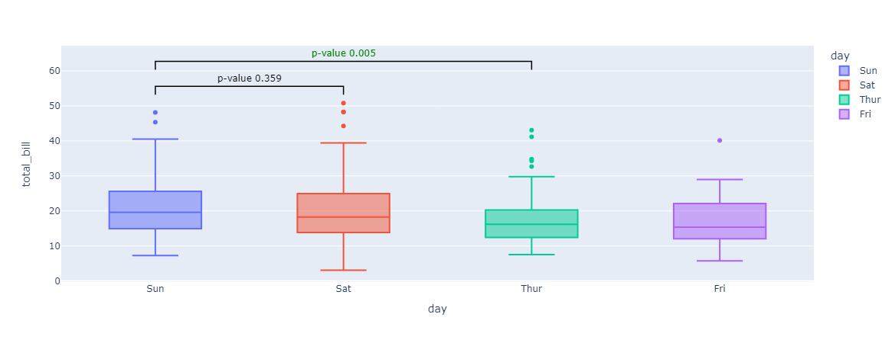

<p align="center">
  
</p>
<p align="center">
  
</p>

## 🚩 Index of Contents
- [What is TAP?](#-what-is-tap)
- [Features](#-features)
- [Installation](#-installation)
- [Examples](#-example)
- [Similar work](#-similar-work)
- [Contributors](#-contributors)
- [Citation](#-citation)

## 📌 What is TAP?

Python package to make statistical tests and add statistical annotations on plot generated with Plotly

## ✅ Features

- Single function to make statistical tests and add statistical annotations on plot generated with Plotly:
    - **Box plots**
    - **Strip plots**

- Integrated statistical tests (`scipy.stats` methods):
    - **Mann-Whitney test**
    - **t-test (independent and paired)**
    - **t-test-related (dipendent)**
    - **Levene test**
    - **Wilcoxon test**
    - **Kruskal-Wallis test**
    - **Brunner-Munzel test**
    - **Ansari-Bradley test**
    - **CramerVon-Mises test**
    - **Kolmogorov-Smirnov test**
    - **Alexander-Govern test**
    - **Fligner-Killeen test**
    - **Bartlett test**

- Correction for statistical tests can be applied (`statsmodel.stats.multitest.multipletests` method):
    - **Bonferroni**
    - **Sidak**
    - **Holm-Sidak**
    - **Benjamini-Hochberg**

- Exporting plots to formats:
    - **png**
    - **jpeg**
    - **webp**
    - **svg**
    - **pdf**
    - **html**

## 📦 Installation
[](https://pepy.tech/project/Taplib)

**TAP** is present on pipy, and can be downloaded directly with pip
```bash
pip install taplib
```
Or if you prefer you can clone the repository and install it manually
```bash
git clone https://github.com/FedericaPersiani/tap.git
cd tap
pip install .
```

## 🔍 Example
Once your dataframe has been loaded you can pass it to the **plot_stats** function which will apply the **Mann-Whitney** test by default on all classes present in the column indicated as **x**, using the **y** column as the value
```python
import tap
import seaborn as sns

df = sns.load_dataset("tips")
x = "day"
y = "total_bill"

tap.plot_stats(df, x, y)
```

---
**Cutoff pvalue**: You can change the significance of the null hypothesis through the **cutoff_pvalue** parameter, by default it is set to 0.05.
```python
tap.plot_stats(df, x, y, cutoff_pvalue=0.01)
```

---
**Type test**: You can change the test type using the **type_test** parameter
```python
tap.plot_stats(df, x, y, type_test="CramerVon-Mises")
```

---
**Type correction**: You can apply a p-value correction algorithm via the **type_correction** parameter
```python
tap.plot_stats(df, x, y, type_correction="Bonferroni")
```

---
**Order**: You can change the sorting of the plot by passing the list with all the entries present in the **x** column ordered as you prefer
```python
tap.plot_stats(df, x, y, order=["Thur", "Fri", "Sat", "Sun"])
```

---
**Type plot**: You can change the plot type using the **type_plot** parameter
```python
tap.plot_stats(df, x, y, type_plot="strip")
```

---
**Pairs**: You can decide the pairs that will be used to generate the statistics to plot
```python
tap.plot_stats(df, x, y, pairs=[("Sun", "Sat"), ("Sun", "Thur")])
```

---
**Sub category**: Through the **subcategory** parameter it is possible to divide the various entries into a further sub-category, you can decide the various pairings using the **pairs** parameter but in this case you will need to declare them as a tuple (primary category, subcategory)
```python
tap.plot_stats(df, x, y, subcategory="sex")
```

```python
tap.plot_stats(df, x, y, subcategory="sex", pairs=[(("Sun", "Male"), ("Sat", "Male")), (("Sun", "Male"), ("Sun", "Female"))])
```

---
**Filename**: To directly export the image you can use the **filename** parameter, the standard export size is (800, 600, 3) but you can modify it via the **export_size** parameter (width, height, scale-factor)
```python
tap.plot_stats(df, x, y, filename="images/export_1.png", export_size=(800, 400, 3))
```

---
**Kwargs**: Through the **kwargs** parameter you can pass a key/value pairs directly to the plotly function, such as the size of the figure, or a title
```python
tap.plot_stats(df, x, y, kwargs={"width":500, "height":500, "title": "My title"})
```


## 📝 Similar work
This repository is inspired by trevismd/statannotations ([Statannotations](https://github.com/trevismd/statannotations)), which compute statistical tests and annotations with seaborn

## 💬 Citation
[](https://doi.org/10.5281/zenodo.10524002)

BibTeX
```text
@software{persiani_2024_10524002,
  author       = {Persiani, Federica and
                  Malori, Damiano},
  title        = {Discovery-Circle/tap: v0.1.2},
  month        = jan,
  year         = 2024,
  publisher    = {Zenodo},
  version      = {0.1.2},
  doi          = {10.5281/zenodo.10524002},
  url          = {https://doi.org/10.5281/zenodo.10524002}
}
```
APA
```
Persiani, F., & Malori, D. (2024). Discovery-Circle/tap: v0.1.2 (0.1.2). Zenodo. https://doi.org/10.5281/zenodo.10524002
```

## ✨ Contributors
<table align="center">
  <tbody>
    <tr>
      <!-- FEDERICA PERSIANI -->
      <td align="center" valign="top" width="14.28%">
        <a href="https://github.com/FedericaPersiani">
          
          <br />
          <sub>
            <b>Federica Persiani</b>
          </sub>
        </a>
        <br />
        <a title="Code">💻</a>
        <a title="Research">🔬</a>
      </td>
      <!-- DAMIANO MALORI -->
      <td align="center" valign="top" width="14.28%">
        <a href="https://github.com/demian2435">
          
          <br />
          <sub>
            <b>Damiano Malori</b>
          </sub>
        </a>
        <br />
        <a title="Code">💻</a>
        <a title="Packaging">📦</a>
      </td>
      <!-- END -->
    </tr>
  </tbody>
</table>
